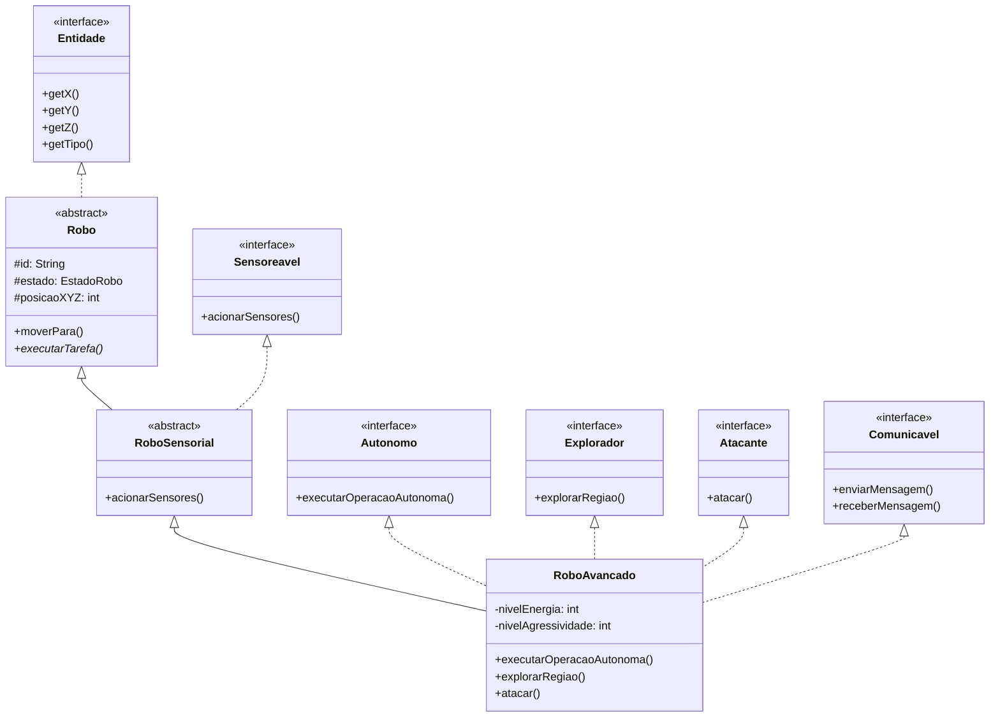

# Projeto MC322 - Sistema de Simulação de Robôs

## Principais Mudanças no Laboratório 4

1. **Novas Interfaces Funcionais**:
   - `Autonomo`: Para robôs que operam sem supervisão
   - `Explorador`: Para robôs que mapeiam o ambiente
   - `Atacante`: Para robôs com capacidades ofensivas
   - `Sensoreavel`: Para robôs com capacidade de sensoriamento
   - `Comunicavel`: Para robôs com capacidade de comunicação

2. **Hierarquia de Classes**:
   - Classe base abstrata `Robo`
   - Classes abstratas intermediárias: `RoboSensorial`, `RoboComunicante`
   - Nova classe concreta `RoboAvancado` implementando múltiplas interfaces

3. **Sistema de Exceções Personalizadas**:
   - `RoboDesligadoException`: Lançada em operações com robô desligado
   - `ColisaoException`: Lançada em tentativas de movimento inválido
   - `ForaDosLimitesException`: Lançada quando coordenadas estão fora do ambiente
   - `AcaoNaoPermitidaException`: Lançada em operações não permitidas
   - `RecargaNecessariaException`: Lançada quando energia está crítica
   - `ErroComunicacaoException`: Lançada em falhas de comunicação

4. **Melhorias no Ambiente**:
   - Implementação de mapa tridimensional
   - Sistema de gerenciamento de entidades
   - Verificação de colisões
   - Visualização do ambiente

## Diagrama UML



## Interfaces Implementadas

1. **Autonomo**
   - Implementada em: `RoboAvancado`
   - Método: `executarOperacaoAutonoma(String objetivo)`

2. **Explorador**
   - Implementada em: `RoboAvancado`
   - Método: `explorarRegiao(int raioExploracao)`

3. **Atacante**
   - Implementada em: `RoboAvancado`
   - Método: `atacar(int alvoX, int alvoY, int alvoZ, int intensidade)`

4. **Sensoreavel**
   - Implementada em: `RoboSensorial`
   - Método: `acionarSensores()`

5. **Comunicavel**
   - Implementada em: `RoboAvancado`
   - Métodos: `enviarMensagem()`, `receberMensagem()`

## Exceções Personalizadas

1. **RoboDesligadoException**
   - Lançada em: `RoboSensorial.acionarSensores()`, `RoboAvancado.executarTarefa()`
   - Quando: Tentativa de operação com robô desligado

2. **ColisaoException**
   - Lançada em: `Ambiente.moverEntidade()`, `Ambiente.verificarColisoes()`
   - Quando: Detecção de colisão entre entidades

3. **ForaDosLimitesException**
   - Lançada em: `Ambiente.dentroDosLimites()`
   - Quando: Coordenadas fora dos limites do ambiente

4. **AcaoNaoPermitidaException**
   - Lançada em: `RoboAvancado.atacar()`
   - Quando: Ação não permitida pelo estado atual do robô

5. **RecargaNecessariaException**
   - Lançada em: `RoboAvancado.executarTarefa()`
   - Quando: Nível de energia crítico

6. **ErroComunicacaoException**
   - Lançada em: `RoboAvancado.enviarMensagem()`, `RoboAvancado.receberMensagem()`
   - Quando: Falha na comunicação entre robôs

## Instruções de Compilação e Execução

### Compilação
```bash
javac Main.java
```

### Execução
```bash
java Main
```

### Funcionalidades Disponíveis no Menu
1. Visualizar ambiente
2. Mover robô
3. Acionar sensores
4. Explorar região
5. Executar operação autônoma
6. Recarregar robô
7. Verificar nível de energia
8. Ligar/Desligar robô

### Observações
- O ambiente e os robôs são inicializados automaticamente
- Testes automáticos são executados antes do menu interativo
- Use as opções do menu para interagir com o sistema

# ProjetoMC322README.txt
==========

Projeto: Simulador de Robôs em Ambiente Virtual

Descrição:
-----------
Este projeto simula diferentes tipos de robôs (terrestres e aéreos) operando em ambientes tridimensionais. Os robôs podem se mover, detectar obstáculos e utilizar sensores para monitorar o ambiente. O sistema oferece um menu interativo para gerenciamento de ambientes, robôs e sensores.

Estrutura dos Arquivos:
------------------------
- Ambiente.java
  - Define o ambiente virtual (largura, comprimento, altura).
  - Gerencia a frota de robôs e a lista de obstáculos.
  - Detecta colisões e controla limites de movimentação.

- Obstaculo.java
  - Representa obstáculos tridimensionais.
  - Verifica se uma posição está bloqueada.

- Robo.java
  - Classe base para todos os tipos de robôs.
  - Gerencia posição, direção, sensores e o ambiente.

- Sensor.java
  - Classe abstrata para todos os sensores dos robôs.
  - Define métodos comuns como `monitorar()`, `getAlcance()`, etc.

- SensorProximidade.java
  - Sensor que calcula distância entre robôs e obstáculos.
  - Especialização de `Sensor`.

- SensorTemperatura.java
  - Sensor que monitora temperatura (simulação).
  - Especialização de `Sensor`.

- RoboTerrestre.java
  - Robô terrestre básico.

- RoboPreparaSolo.java
  - Robô especializado em preparar o solo.

- RoboColheitadera.java
  - Robô especializado em colher recursos.

- RoboAereo.java
  - Robô aéreo básico.

- RoboDrone.java
  - Versão de robô aéreo, tipo drone.

- RoboJato.java
  - Robô aéreo de alta velocidade, tipo jato.

- Main.java
  - Menu interativo em console.
  - Permite selecionar ambientes, listar robôs e obstáculos, mover robôs, ativar/desativar sensores.
  - Exemplo de instanciamento de ambientes, robôs e sensores.

Requisitos:
-----------
- Java 8 ou superior.
- Terminal/Shell ou IDE como Eclipse, IntelliJ ou VSCode para compilar e rodar.

Compilação:
-----------
1. Compile todos os arquivos `.java`:

   ```bash
   javac Main.java
